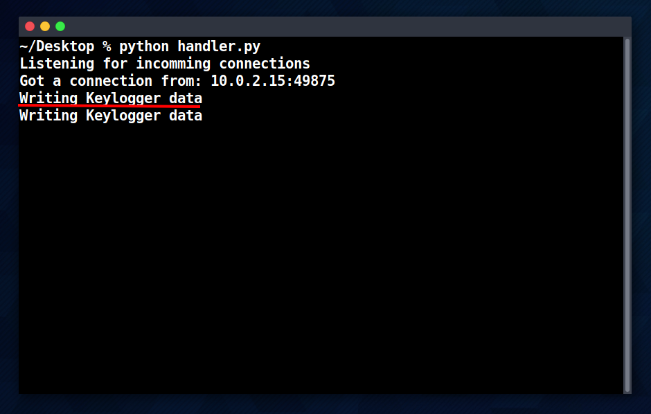
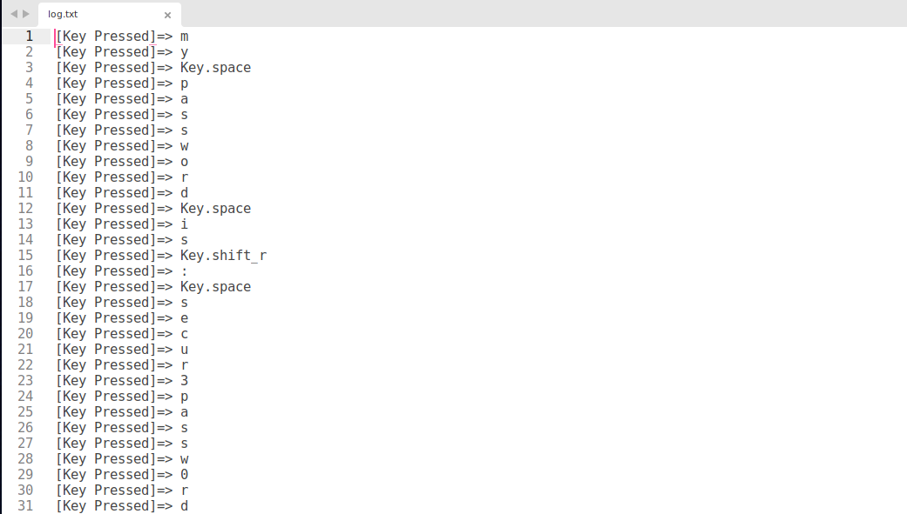

# Keylogger School Project

This school project is about keyloggers.
### What Are Keyloggers?

Keyloggers are a type of malware that record every keystroke you make on your computer, including sensitive information like usernames and passwords. While keyloggers have some legitimate uses, such as for employee monitoring, parental controls, and law enforcement purposes, they can also be used for illegal activities.

### A Simple Remote Keylogger in Python 3

The following scripts allow the user to remotely monitor keystrokes on a target machine by capturing keystrokes and sending them over a socket connection to the server.

### Client Side Script

The **keylogger.py** script captures keystrokes using the **pynput** library and sends them to a remote server. It does this by defining two functions: **send_data()** and **on_press()**.

The **on_press()** function listens for key presses, converts them to strings, and adds them to a buffer (data_to_send variable) to be sent by **send_data()**.

The **send_data()** function creates a socket object (used to connect to the remote server) and sends any data captured by **on_press()**.

### Server Side Script

The handler.py script creates a socket and listens for incoming connections on port 4242. When a connection is established, the code receives data from the connection and writes it to a log file called "log.txt" using the **write_logs()** function. The code continues to receive and log data until the connection is closed by the sender.

### Testing the Scripts

The keylogger.py script is executed on a Windows virtual machine, emulating a victim infected with the keylogger. The handler.py script is executed on a Linux virtual machine, representing an attacker.

The following screenshot shows the script being executed by the victim. Once the script is executed, the user types text as shown in the red underline.

The following screenshots show the attacker receiving a connection on the terminal and the keys logs saved in the log file.

### Conclusion

The scripts we discussed represent a potential malware scenario in which a keylogger is used to steal sensitive information from a victim. This type of attack can be devastating for individuals, businesses, and organizations alike.

To protect ourselves from malware like keyloggers, we can take a few simple steps:

- Install and regularly update anti-malware software.
- Avoid clicking on suspicious links or downloading files from untrusted
sources.
- Use strong, unique passwords and enable two-factor authentication whenever possible.